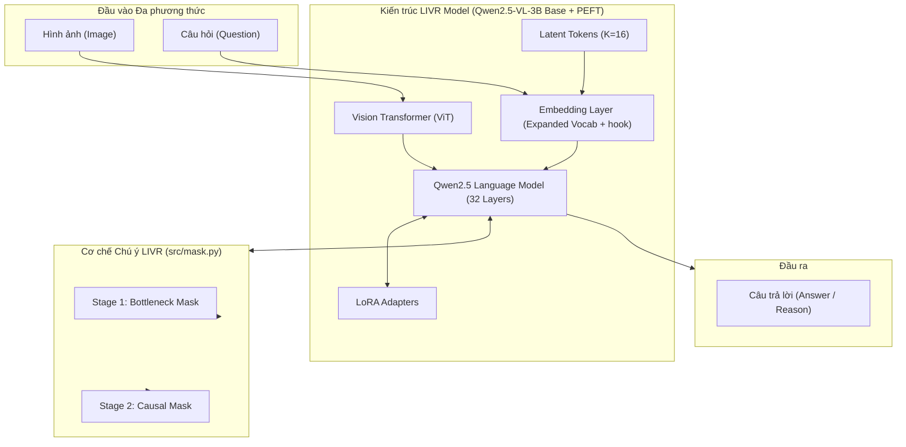
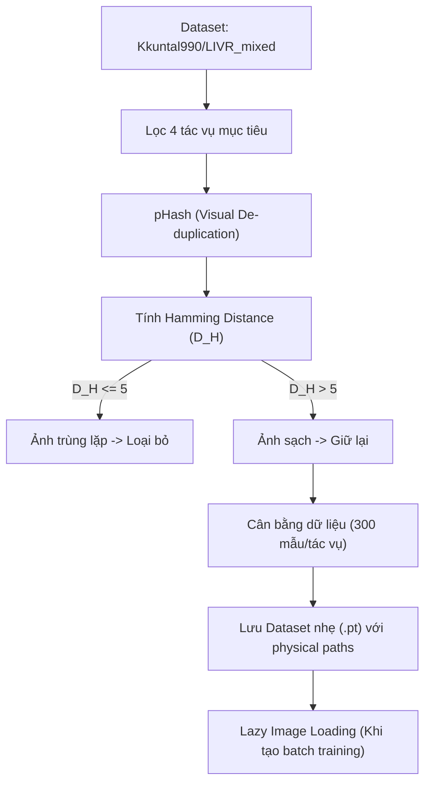
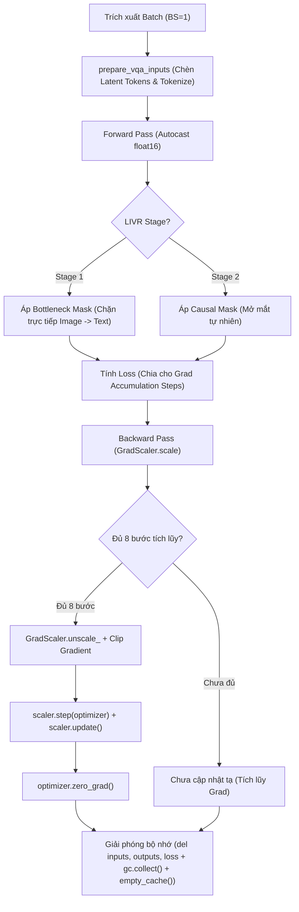
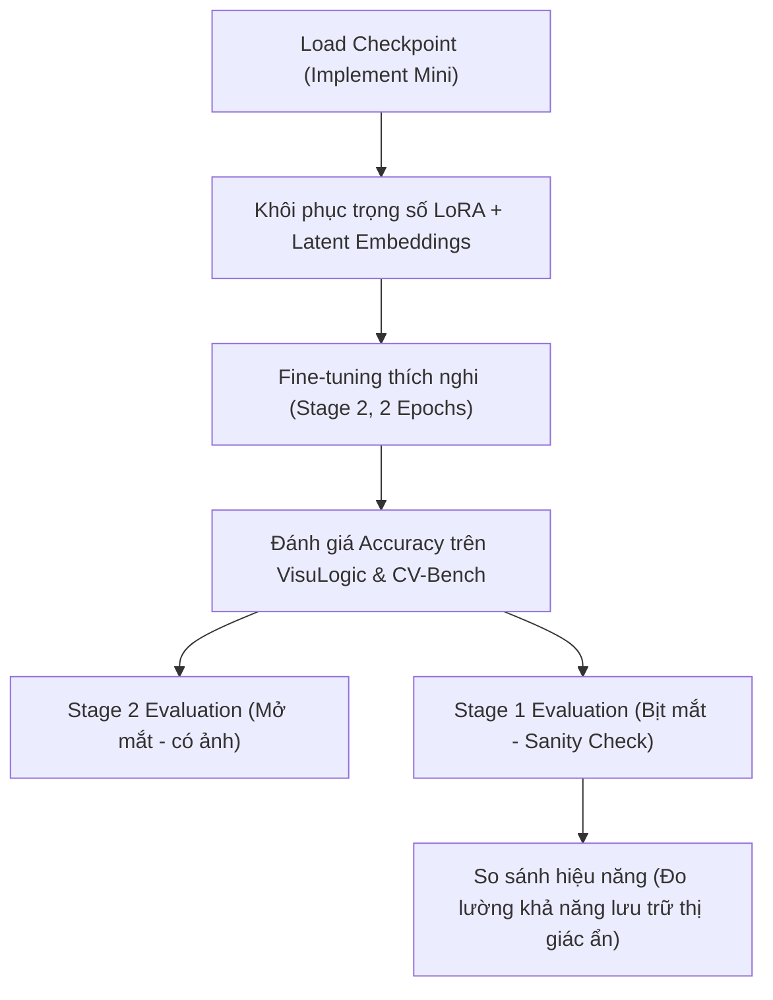

# 📑 TÀI LIỆU KIẾN TRÚC VÀ SƠ ĐỒ LUỒNG HỆ THỐNG: LIVR-MINI-BENCHMARK

Tài liệu này cung cấp cái nhìn chi tiết về mặt kỹ thuật, sơ đồ luồng dữ liệu, cấu trúc mạng và các kỹ thuật tối ưu hóa được áp dụng trong dự án **LIVR (Latent Implicit Visual Reasoning)**. Tài liệu được thiết kế chi tiết nhằm hỗ trợ quá trình thuyết trình dự án và nghiệm thu khoa học.

---

## 1. Kiến trúc Mô hình LIVR (LIVR Model Architecture)

Kiến trúc LIVR được xây dựng dựa trên mô hình nền tảng đa phương thức **Qwen2.5-VL-3B-Instruct** kết hợp cấu hình tinh chỉnh tham số hiệu quả **PEFT LoRA** và mở rộng bảng từ vựng cho **Latent Tokens**.

### Sơ đồ Kiến trúc Tổng quan (System Block Diagram)

### Giải thích các thành phần chính:
1.  **Vision Transformer (ViT):** Trích xuất các đặc trưng thị giác từ ảnh đầu vào và ánh xạ chúng thành các Visual Tokens.
2.  **Embedding Layer & Vocab Expansion:** Bảng từ vựng của tokenizer được mở rộng thêm $K=16$ tokens đặc biệt (`<latent_0>` đến `<latent_15>`). Một **Backward Hook** được đăng ký tại đây để triệt tiêu toàn bộ gradient của các token ngôn ngữ gốc, ép chỉ cập nhật vector nhúng cho các Latent Tokens ẩn.
3.  **LoRA Adapters:** Các ma trận phân rã hạng thấp ($r=16, \alpha=32$) được cài đặt tại các lớp Attention và MLP của LLM để huấn luyện hiệu quả mà không cần cập nhật toàn bộ tham số mô hình.
4.  **Cơ chế Chú ý LIVR (src/mask.py):** Monkey-patch động hàm `forward` để kiểm soát luồng thông tin chú ý (Attention Scores) dựa theo giai đoạn huấn luyện (Stage 1 / Stage 2).

---

## 2. Pipeline Tiền xử lý Dữ liệu (Data Preprocessing Pipeline)

Pipeline dữ liệu đảm bảo tính sạch, cân bằng và tối ưu hóa bộ nhớ tối đa thông qua các bộ lọc pHash và cơ chế nạp ảnh lười (Lazy Loading).

### Sơ đồ Luồng Tiền xử lý Dữ liệu

### Các bước hoạt động chi tiết:
1.  **Lọc tác vụ:** Lọc ra 4 tác vụ mục tiêu: `counting`, `object_localization`, `jigsaw`, và `visual_similarity`.
2.  **Visual De-duplication (pHash):** 
    *   Tính toán mã băm nhận thức (Perceptual Hash) cho từng ảnh.
    *   So sánh khoảng cách Hamming ($D_H$). Nếu $D_H \le 5$, ảnh bị coi là trùng lặp cấu trúc và bị loại bỏ để tránh hiện tượng rò rỉ dữ liệu (data leakage).
3.  **Cân bằng dữ liệu:** Trích xuất chính xác 300 mẫu sạch cho mỗi tác vụ, tạo thành tập dữ liệu con 1,200 mẫu cân bằng.
4.  **Lazy Loading:** Để tránh lỗi tràn RAM hệ thống khi serialize đối tượng ảnh lớn, tập dữ liệu chỉ lưu trữ đường dẫn ảnh cục bộ (`str`). Quá trình đọc ảnh thực tế qua `PIL.Image.open` chỉ thực hiện động khi tạo mini-batch.

---

## 3. Vòng lặp Huấn luyện và Kỹ thuật Tối ưu VRAM (Training & Memory Flow)

Đây là cốt lõi kỹ thuật giúp chạy ổn định mô hình 3B trên GPU 16GB VRAM bằng cách phối hợp AMP, GradScaler, Gradient Checkpointing và giải phóng bộ nhớ chủ động.

### Sơ đồ Vòng lặp Huấn luyện Chi tiết

### Các kỹ thuật tối ưu hóa bộ nhớ cốt lõi:
1.  **Bottleneck Attention Masking (Stage 1):** 
    *   Chặn chú ý trực tiếp: $\text{Image} \not\to \text{Prompt}$ và $\text{Image} \not\to \text{Answer}$.
    *   Cho phép chú ý gián tiếp: $\text{Image} \to \text{Latent} \to \text{Prompt/Answer}$.
    *   Giá trị phạt âm an toàn: Dùng **`-30000.0`** thay cho `-65500.0` để tương thích hoàn hảo với giới hạn dưới của `float16` (`-65504.0`), ngăn ngừa hoàn toàn lỗi `NaN` Loss.
2.  **Gradient Checkpointing (Non-reentrant):** Giải phóng bộ nhớ kích hoạt (activation memory) của các tầng trung gian và chỉ tính toán lại (recompute) chúng trong lượt chạy ngược. Giúp tiết kiệm **~60% VRAM**.
3.  **GradScaler:** Thực hiện scale-up giá trị Loss trước khi backward và unscale trước khi step để ngăn chặn hiện tượng triệt tiêu đạo hàm (underflow) khi tính toán ở độ chính xác `float16`.
4.  **Active Memory Deallocation:** Lệnh `del inputs, outputs, loss` cùng việc xóa ngoại lệ `del e` giải phóng các liên kết traceback ẩn, kết hợp `torch.cuda.empty_cache()` định kỳ giúp giữ VRAM ở mức ổn định dưới **7GB**.

---

## 4. Quy trình Đánh giá và Kiểm định Khoa học (Evaluation Pipeline)

Quy trình đánh giá đo lường hiệu năng của mô hình trên các tập dữ liệu mới lạ hoàn toàn (Novel Datasets) dưới hai chế độ: Stage 2 (Mở mắt) và Stage 1 (Bịt mắt).

### Sơ đồ Luồng Đánh giá (Evaluation Flow)

### Ý nghĩa của Sanity Check (Stage 1 Evaluation):
*   Khi đánh giá ở **Stage 2 (Mở mắt)**: Đo lường độ chính xác tổng quát của mô hình khi có đầy đủ thông tin thị giác.
*   Khi đánh giá ở **Stage 1 (Bịt mắt - Sanity Check)**: Chặn hoàn toàn ảnh đột ngột. Mô hình bắt buộc phải dựa vào 16 Latent Tokens đã được mã hóa để suy luận. Nếu độ chính xác ở Stage 1 đạt kết quả cao tương đồng Stage 2, điều đó chứng minh về mặt khoa học rằng **các Latent Tokens đã lưu trữ và đại diện hoàn hảo cho thông tin ảnh ẩn**.
