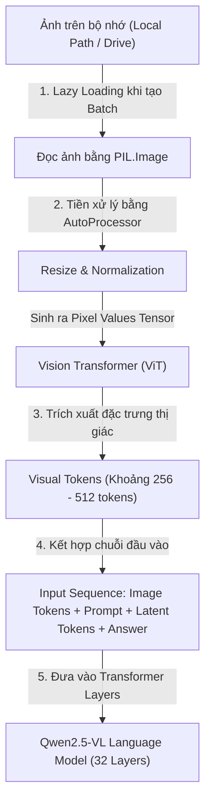
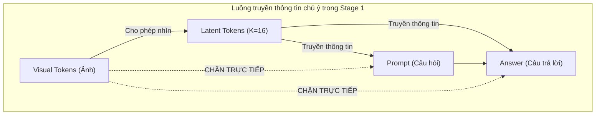
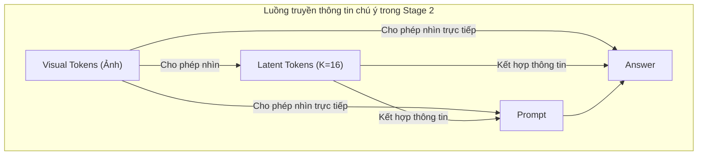

# 📸 QUÁ TRÌNH XỬ LÝ ẢNH VÀ HUẤN LUYỆN CHI TIẾT TRONG LIVR (DETAILED TRAINING PROCESS)

Tài liệu này giải thích chi tiết về cách mô hình **LIVR-Mini** nạp, xử lý và huấn luyện trực tiếp trên hình ảnh, cùng với luồng đi của dữ liệu qua các tầng kiến trúc mạng trong suốt 2 giai đoạn (Stage 1 & Stage 2).

---

## 1. Trả lời câu hỏi: Có phải mô hình được huấn luyện trực tiếp trên ảnh không?

**CÓ, quá trình huấn luyện được thực hiện trực tiếp trên hình ảnh đầu vào.** 

Tuy nhiên, mô hình không "nhìn" ảnh ở dạng pixel thô (RGB) như mắt người, mà hình ảnh sẽ được chuyển đổi thành chuỗi các **Visual Tokens** (các vector số biểu diễn đặc trưng thị giác) và đưa vào context cùng lúc với các token văn bản (câu hỏi, câu trả lời, latent tokens).

Điểm đặc biệt của LIVR là **cách mô hình được phép chú ý (attend) vào các Visual Tokens này** thông qua hai giai đoạn huấn luyện:
*   **Stage 1 (Bịt mắt - Visual Bottlenecking):** Chặn không cho mô hình nhìn trực tiếp ảnh từ câu hỏi và câu trả lời. Ép thông tin ảnh phải "chui" qua một nút cổ chai là $K=16$ Latent Tokens.
*   **Stage 2 (Mở mắt - Joint Training):** Mở lại toàn bộ tầm nhìn để mô hình kết hợp cả ảnh gốc và các Latent Tokens (lúc này đã được làm giàu thông tin thị giác từ Stage 1) nhằm đưa ra câu trả lời chính xác nhất.

---

## 2. Luồng xử lý hình ảnh chi tiết (Image Data Flow)

Dưới đây là sơ đồ luồng đi của một bức ảnh từ đĩa cứng cho đến khi được đưa vào bộ xử lý ngôn ngữ của Qwen2.5-VL:

### Các bước hoạt động cụ thể:

1.  **Lazy Loading (Tải lười):** Để tránh tràn RAM hệ thống của Colab, ảnh không được nạp sẵn. Khi vòng lặp huấn luyện yêu cầu một batch, đường dẫn ảnh vật lý (như `/path/to/image.jpg`) mới được đọc lên bởi thư viện `PIL.Image`.
2.  **Định cấu hình độ phân giải (AutoProcessor):** Ảnh được đưa qua `AutoProcessor` cấu hình giới hạn kích thước động (`min_pixels = 256 * 28 * 28` và `max_pixels = 512 * 28 * 28`). Việc này chuẩn hóa ảnh về độ phân giải phù hợp, tránh sinh quá nhiều visual tokens gây tràn bộ nhớ VRAM của GPU T4.
3.  **Mã hóa qua ViT:** Module Vision Transformer (ViT) của Qwen2.5-VL tiếp nhận ảnh và trích xuất các đặc trưng không gian (spatial features). Mỗi vùng nhỏ của ảnh sẽ được đại diện bởi 1 vector đặc trưng (Visual Token).
4.  **Tích hợp vào chuỗi đầu vào (Input Embeddings):** Các Visual Tokens này được nhúng (embed) vào không gian vector của Language Model và xếp hàng liền trước Prompt (Câu hỏi) cùng các Latent Tokens.

---

## 3. Hoạt động chi tiết của 2 Giai đoạn Huấn luyện

### 📊 Bảng so sánh 2 Giai đoạn Huấn luyện

| Đặc trưng | Stage 1 (Huấn luyện Nút Cổ Chai) | Stage 2 (Huấn luyện Tích hợp) |
| :--- | :--- | :--- |
| **Trạng thái chú ý** | **Bịt mắt** (Mô hình chỉ được nhìn ảnh gián tiếp qua Latent) | **Mở mắt** (Nhìn trực tiếp cả ảnh và Latent) |
| **Cơ chế Masking** | `Ans -> Vision` (Bị chặn) `Prompt -> Vision` (Bị chặn) `Latent -> Vision` (Cho phép) | `Causal Attention Mask` tiêu chuẩn (Không chặn gì đối với Vision) |
| **Mục tiêu chính** | Ép 16 Latent Tokens học cách tóm tắt và lưu trữ thông tin ảnh | Dạy mô hình cách phối hợp ảnh gốc và Latent Tokens để suy luận tốt nhất |
| **Learning Rate (LR)** | `stage1_lr` (thường là `1e-4` hoặc `5e-5`) | `stage2_lr` (thấp hơn, thường là `5e-5` or `2e-5`) |

---

### Giai đoạn 1: Huấn luyện Nút Cổ Chai (Visual Bottlenecking)

Trong giai đoạn này, cơ chế **Attention Masking** sửa đổi ma trận chú ý để kiểm soát luồng thông tin truyền nhận như sau:

*   **Tại sao lại chặn?** Nếu không chặn, mô hình sẽ bỏ qua các Latent Tokens mới thêm vào (vì chúng chưa học được gì và khởi tạo ngẫu nhiên) và chỉ chăm chăm nhìn vào ảnh gốc để trả lời.
*   **Khi chặn:** Để trả lời đúng câu hỏi (được tính Loss trên các answer tokens), mô hình buộc phải tìm cách lấy thông tin từ ảnh. Con đường duy nhất là truyền thông tin từ `Vision -> Latent -> Answer`. Do đó, 16 Latent Tokens bị ép buộc phải học cách chắt lọc và đại diện cho các nội dung quan trọng nhất của bức ảnh.
*   **Cơ chế cập nhật:** Optimizer sẽ cập nhật trọng số của **LoRA Adapters** và **Latent Embeddings** (bảng nhúng của 16 latent tokens). Một `Backward Hook` đặc biệt sẽ chặn không cho cập nhật các từ vựng ngôn ngữ gốc để giữ nguyên tri thức ngôn ngữ của mô hình.

---

### Giai đoạn 2: Huấn luyện Tích hợp (Joint Training)

Sau khi kết thúc Stage 1, 16 Latent Tokens đã có khả năng lưu trữ thông tin thị giác ẩn tốt. Mô hình chuyển sang Stage 2:

*   **Tại sao lại mở mắt?** Ở Stage 2, mô hình học cách kết hợp cả thông tin thô từ ảnh gốc (`Vision`) và thông tin trừu tượng ẩn đã được tích lũy trong `Latent Tokens`. Sự kết hợp này mang lại hiệu quả vượt trội (tăng trung bình 6% độ chính xác so với huấn luyện SFT thông thường trên các bài test thị giác khó).
*   **Tinh chỉnh nhẹ nhàng:** Lúc này mô hình đã có form tốt, chúng ta hạ Learning Rate xuống thấp hơn (`STAGE2_LR`) để tinh chỉnh tinh tế các trọng số mà không làm hỏng những gì đã học ở Stage 1.

---

## 4. Các kỹ thuật đảm bảo ổn định số học khi huấn luyện với float16

Khi chạy trên GPU Tesla T4 (16GB VRAM) của Colab, việc sử dụng kiểu dữ liệu `float16` rất dễ gây ra lỗi **NaN Loss** (do tràn số). Hệ thống đã áp dụng các kỹ thuật sau để triệt tiêu lỗi này:

1.  **Sử dụng GradScaler (Tỷ lệ hóa đạo hàm):** Nhân Loss với một hệ số lớn trước khi lan truyền ngược (`scaler.scale(loss).backward()`) để tránh việc đạo hàm bị quá nhỏ biến thành `0.0` (Underflow). Sau đó, `scaler` sẽ đưa đạo hàm về dải thực tế trước khi cập nhật trọng số.
2.  **Giá trị phạt Attention Mask an toàn (`-30000.0`):** Giá trị mặc định thường dùng là `-65500.0` để chặn sự chú ý. Tuy nhiên, giới hạn dưới của `float16` là `-65504.0`. Khi cộng thêm các điểm số chú ý âm khác, giá trị sẽ dễ dàng vượt quá `-65504.0` và biến thành `-inf` hoặc `NaN`. Hạ giá trị phạt về **`-30000.0`** giữ cho phép tính luôn nằm trong dải an toàn của `float16`.
3.  **Gradient Clipping (Cắt cụt đạo hàm ở mức 0.5):** Giới hạn độ lớn vector gradient không vượt quá `0.5`, loại bỏ hoàn toàn nguy cơ bùng nổ đạo hàm (Gradient Exploding) gây NaN.
4.  **Giải phóng bộ nhớ chủ động:** Sử dụng `del inputs, outputs, loss` và `torch.cuda.empty_cache()` định kỳ sau mỗi step huấn luyện để giải phóng triệt để VRAM rác, giữ cho quá trình huấn luyện ổn định dưới 7GB VRAM mà không bị OOM.
